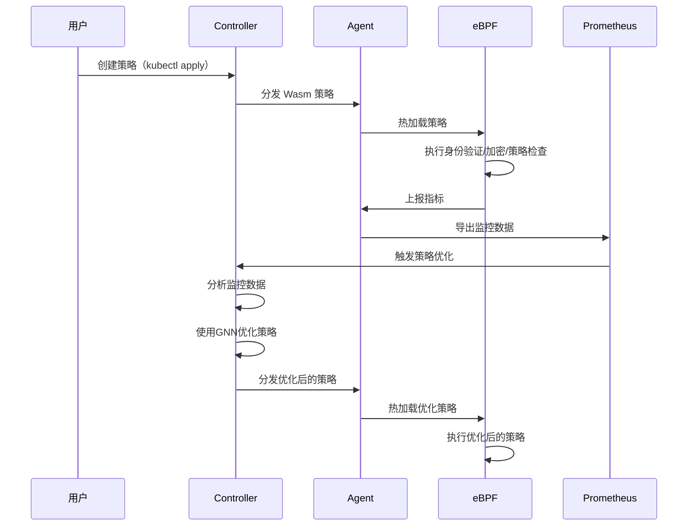

# AegisNet 工作流程序列图

以下序列图展示了 AegisNet 零信任网络安全解决方案的完整工作流程，从策略创建到执行、监控，再到优化形成闭环。

## 工作流程说明

1. **策略创建与分发**
   - 用户通过 `kubectl apply` 创建零信任策略
   - Controller 将策略转换为 Wasm 格式并分发给各节点的 Agent

2. **策略执行**
   - Agent 将 Wasm 策略热加载到 eBPF 程序
   - eBPF 在内核层执行身份验证、加密和策略检查

3. **监控与数据收集**
   - eBPF 程序将执行结果和指标上报给 Agent
   - Agent 将指标导出到 Prometheus 监控系统

4. **策略优化闭环**
   - Prometheus 数据触发 Controller 进行策略优化
   - Controller 使用图神经网络(GNN)分析流量模式
   - Controller 生成优化后的策略并再次分发
   - Agent 热加载优化后的策略到 eBPF 程序

这种闭环设计使 AegisNet 能够根据实际网络行为自适应调整策略，提高安全性的同时减少冗余规则，降低系统开销。